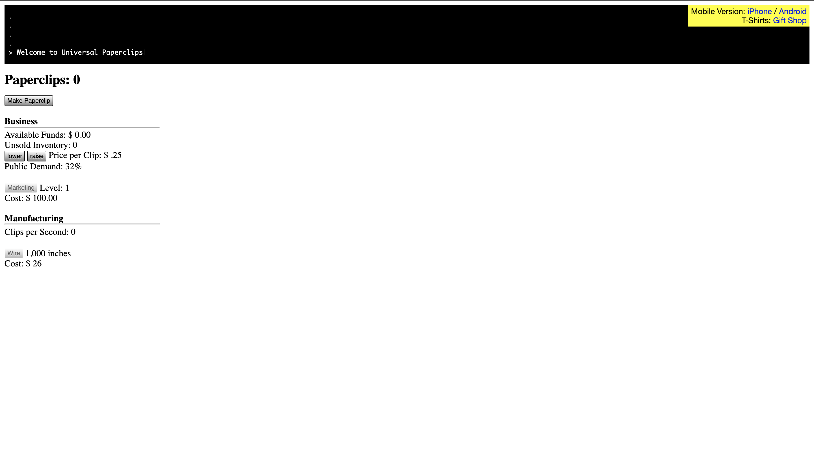
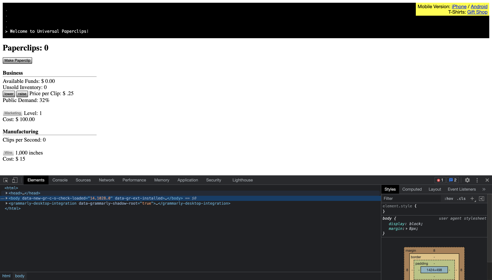
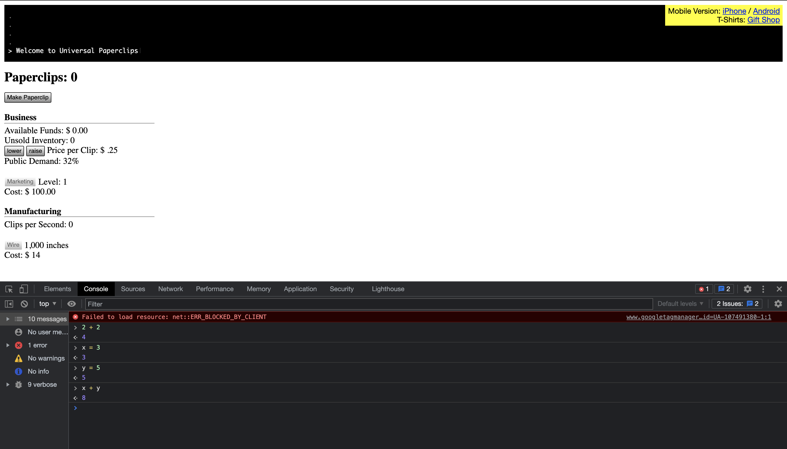
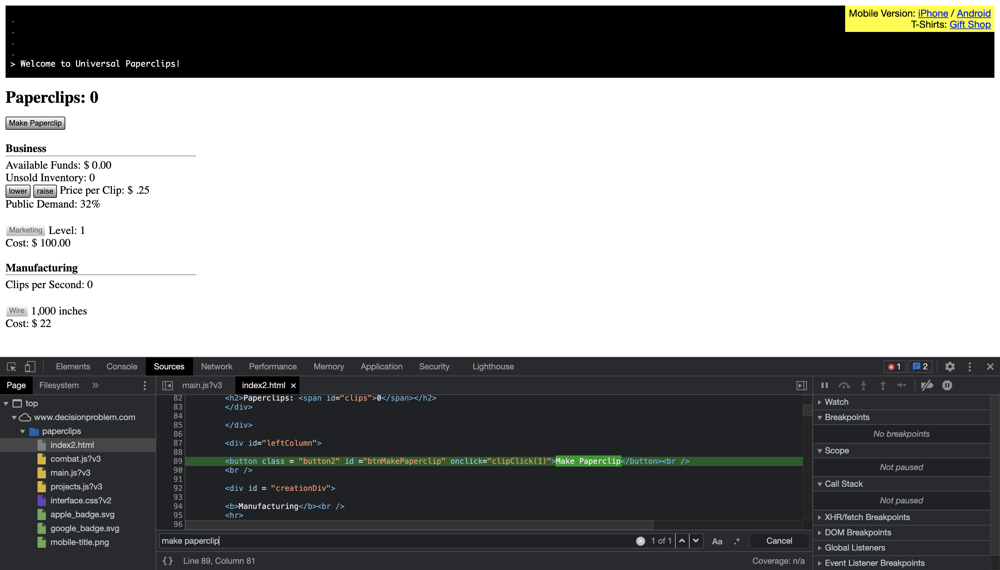
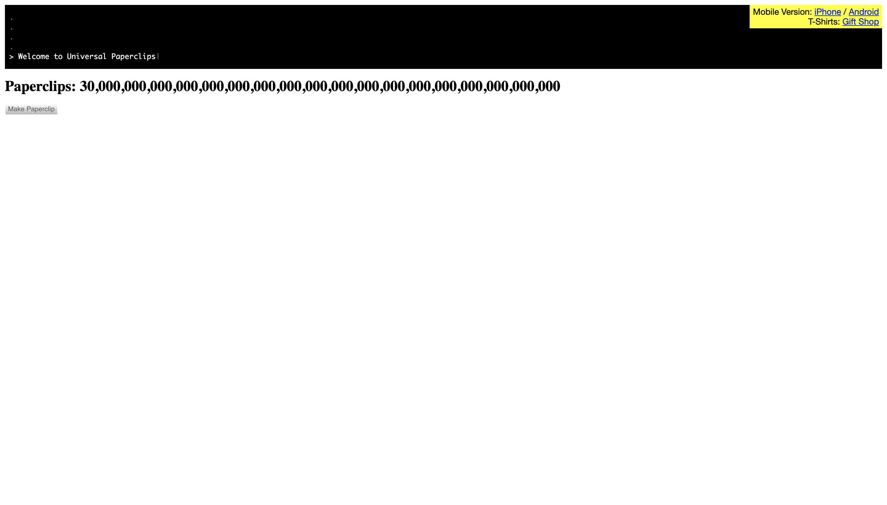

# Universal Paperclips

## Objectives

Universal paperclips is an idle clicker game where the user tries to make as many paper clips as they can as fast as possible. The game has very clear variables and functions that are easy to interact with and change with the Javascript console in your browser. By the end of the lesson you should have beaten the game and have a better grasp on the capabilities of the Javascript console.

[link to universal paperclips](https://www.decisionproblem.com/paperclips/index2.html)

## Javascript console

To open up the JS console right click anywhere on the webpage and select 'inspect'. This will bring up a console with a number of tabs at the bottom or the side of the webpage. The main tabs we will be using today are 'Elements', 'Console', and 'Sources'.

## Terminology

### Elements

Elements lets you inspect the html in the page. You can scroll through the different tags that are present on the webpage. If you would like to look more closely at a specific item on the page, instead of scrolling through and expanding and collapsing all of the tags we can use the select tool. This is the mouse and square icon in the top left of the JS console. Once we click on it we can mouse over any item on the page and see where in the html file it is located at and what aspects it has assigned to it. If we click on any item it will all us to select it in the html. Here you can change any of the text in the file, note however that if you change a number on the file you might not be changing the variable that the number is associated with. To do this we need to use the next tab, the console.

### Console

The Javascript console is a console built into your browser that gives you a greater control over the webpage than the Elements tab does. In the console you can do any operation that you could normally do in your IDE such as mathematical operations, variable assignment, and even the ability to create and call functions. This will be a very helpful tool in this assignment.

### Sources

Lastly there is the sources tab. This tab shows all the file associated with the webpage. These are listed on the left side of the console. The files we are concerned with are he 'index2.html', 'combat.jsv?3', 'main.js?v3', and 'projects.js?v3'. In these files we can find every variable and function declaration as well as edit them. This will also be very helpful in this assignment.

## Variables

In the game there are many variables that you are constantly trying to gain and then turn around and spend to increase the rate at which you gain these resources. As the game progresses into the different phases more of the resources unlock, so to help point you in the right directions there is a dictionary of the resources below and how they are significant.

- Paperclips - The main resource of the game. Phases are locked behind amount of paper clips.
- Money - Used to buy upgrades and more resources.
- Wire - Bought resource that gets converted into paperclips.
- Marketing - Price paperclips are willing to be bought at is based on marketing.
- Autoclippers - Automatically converts wire into paperclips.

- Trust - trust given to you by humans. Gain more trust at certain paperclip thresholds. Trust is used to upgrade processor and memory level.
- Processor - generates operations which can be used to buy upgrades.
- Memory - maximum amount of operations that can be stored.
- Creativity - resource that is gained once operations are at maximum.

- Yomi - generated by spending operations on strategy tournaments after unlocking the 'Strategic Modeling' project. Can be spent to upgrade investment engine.

- Drones - gathers raw material to convert into wire, converts into wire.
- Solar farms - generates power to power drones.
- Batteries - stores excess power for drones.
- Clip factory - converts wire into paperclips.

- Probes - used to explore the universe to find more raw material to convert into paperclips. Hover over upgrade purchase button to see what each upgrade improves.

## Ending

The game is over once you have ran out of resources to collect, have dismantled all of your factories, and made the last paperclip.

## Hints

- Make sure to progress slowly through each phase. If you jump too far ahead the game may break and you will have to start over.
- changing the text in the html file might not always change the actual variable value.
- Whenever a button is clicked it calls a function. Try finding the function in the JS file and editing that instead of the variable itself.
- Looking into the projects JS file we can see all of the projects that are unlockable and their conditions. You can edit these values to speed up how fast you unlock these projects
